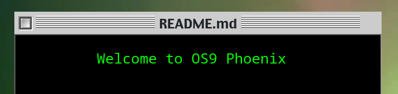
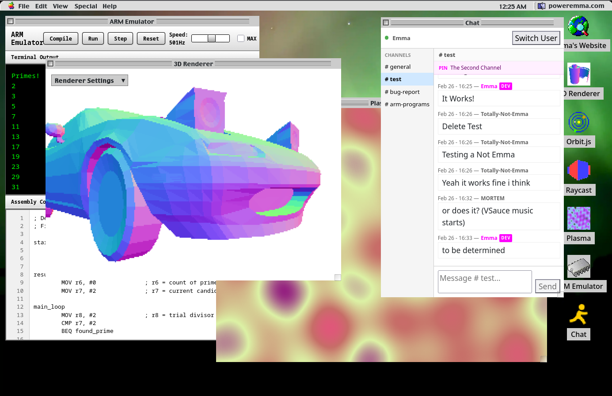

### My personal website, inspired by the classic MacOS theme, built using React
As per the "phoenix", this is a revival of a similarly themed project I made in plain JavaScript

React was chosen due to it's component system, allowing any react application to be nested in a window object. It's robust state manager also allowed for easier implementation of features such as and "active window" system and window closing

## Included Applications
### Desktop
- The main application launcher on the website. Loads applications by name from the server to get the layout of icons.
### Portfolio
- The landing page of the website, showcases myself as well as my projects and photos
- Showcases traditional web design, on a website that is optimized for desktop and mobile viewing
### 3D Renderer
- A software based 3d renderer, complete with rasterisation, and optimizations
- Will be upgraded to WEBGL one day, however the renderer is quite performant on modern machines
### Plasma
- A Demoscene style graphics demo, similar to that of electromagnetic radiation
- Also is the background of the main portfolio page
### ARM Emulator
- A modified version of an ARM assembler [`Neurotic`](https://github.com/power-emma/neurotic) and emulator [`Tranquil`](https://github.com/power-emma/tranquil), integrated into an IDE for easy programming and execution
- For more in depth information, read the sample code of the emulator, as well as an ARM assembly textbook.
### Chat
- A simple IRC style chat application, implemented using websockets.
- While somewhat interesting on its own, the AOL style theme combined with the rest of the UI makes for a fairly immersive experience
### Orbit.JS
- A modified version of a traditional JS application of the same name [`orbit`](https://github.com/power-emma/orbit)
- Allows for gravitational modelling of a practically unlimited number of objects, and adding these objects by clicking on the screen
### Raycast
- A port of a java application of the same name [`raycast-java`](https://github.com/power-emma/raycast-java)
- Simulates a 3d effect in a 2d world using the raycasting technique, see the [wikipedia article](https://en.wikipedia.org/wiki/Ray_casting#) for an in depth explanation

## Run Instructions
- Clone Repo
- Run `npm i` to acquire all dependencies

### Local Development
Two terminals are needed — the Vite dev server proxies `/api/*` to the Express backend automatically. 
run `./dev.sh` to run both the client and server together. Localhost is typically on port 5173 for the client and 3000 for the server

### Production
nginx proxies `/api/*` to the Express backend on port 3000 and serves the built client bundle.
- Run `./deploy.sh` to host to the live internet. Some nginx config may be needed, but can be set in this script file

### Sample Photo

